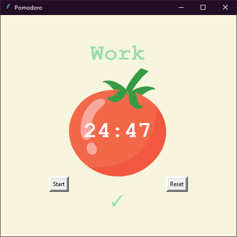
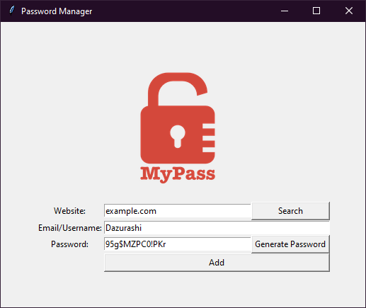
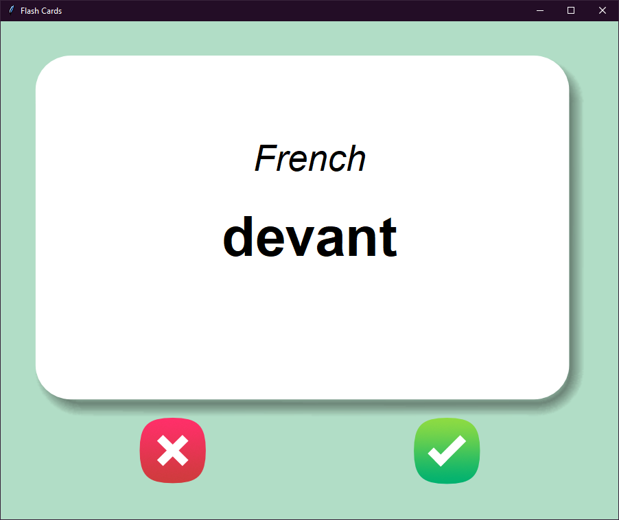
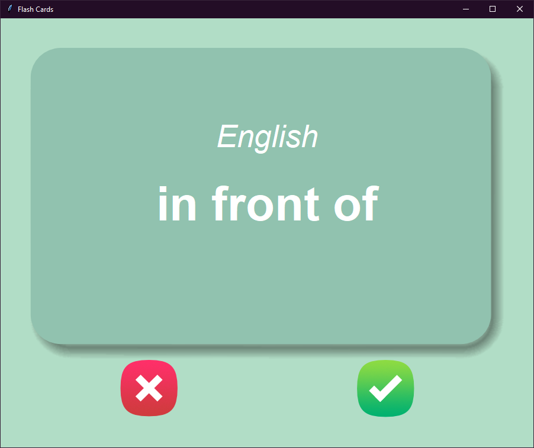

# 100 Days Of Code Content

## Day 1
### Band name generator
A dull basic program to generate a "band" name from user input.

## Day 2
### Tip Calculator
Program which asks user the total bill, percentage of tip they want to pay and how many people will split the bill. Then it calculates how much each person should pay. 

## Day 3
### Adventure Game
Simple text-based decision game that asks 3 questions which player need to explore to find the right path and win the game.

## Day 4
### Find The Tresure
Game where computer hides randomly a treasure in 3x3 grid and player needs to guess where it is.
### Rock-Paper-Scissors
Classic rock-paper-scissors game.

## Day 5
### FizzBuzz
Solution for classic FizzBuzz program.
### Password Generator
Generates a password based on user input.

## Day 6
### Solution for Reeborg's World puzzle
Guides the robot to its goal without getting stuck. Link to the problem is in the text file under day 6 folder as well as the algortihm needed to solve it.

## Day 7 
### Hangman
Simple game of classic hangman.

## Day 8
### Caesar Cipher
Program uses Caesar cipher to encode message. Use can also decode messages if they know the given shift.

## Day 9
### Secret Auction
Secret auction is an auction where bidders can't see the bids of others. In the end the person who's bid was highest wins the item.

## Day 10
### Calculator
Simple a arithmetic calculator that allows user to keep manipulating results that they got.

## Day 11
### Blackjack
A game of Blackjack where computer is the dealer. Played on console. 

## Day 12
### Number Guessing Game
If you're a programmer, you've probably made a program like this. The point is to guess a random number. In this case the number is between 1 and 100.

## Day 13
### Debugging
The content I've been following didn't have a project for this day. Instead there was concepts of debugging introduced. 

## Day 14
### Higher-Lower
In this game/quiz the user tries to guess which of the two given famous people have bigger social media following. 

## Day 15
### Coffee Machine
Somehow tried to mimic the funtionality of coffee machine found in cafes or homes. Doesn't leak onto your keyboard.

## Day 16
### Coffee Machine OOP
The classes were not written by me. The point of this practise was to get familiar with pre-made classes (which I was already familiar with) and repeat similar functionality as on Day 15.

## Day 17
### Quiz Game
Well, it's a quiz game. User is asked true/false questions and they try to score as high as possible.

## Day 18
### Hist Painting
Supposedly paintings like this program makes, were sold for half a million dollars. If you want to pay me the same, please contact me. 

## Day 19
### Turtle Race
User bets on a turtle. Turtles then race towards the end of the screen and user hopes for the best.

## Day 20
### Snake Game V1
First version of the classic snake game. This project will be updated in the following days.

## Day 21
### Sanke Game V2
The game now works as intended. There are further updates in the future like adding highscore.

## Day 22
### Ping Pong Game
Most people know what this is. If you don't, try it out!

## Day 23
### Turtle Crossing Game
A game where you try to cross the road as a turtle while avoiding traffic. Traffic gets faster as you progress to a new level.

## Day 24
### Birthday Invitation Generator
This program will read invitations from a text file and then create an invitation for each person in it. The point of this practice was to use paths and manipulate files.

## Day 25
### The states of the USA guessing game
Player is trying to name all 50 states.

## Day 26
### NATO Alphabets
User will enter a word for the program and it will change it into a list of NATO alphabets. For example: input = "Bob" -> output = ['Bravo', 'Oscar', 'Bravo']

## Day 27
### Miles to kilometers converter
GUI in tkniter to do what title says

## Day 28
### Pomodoro Timer
A pomodoro timer. There are 4x 20-minute sessions. After 3 of the first sessions there are 5-minute breaks but after the 4th session there's a longer 20-minute break. User is able to reset the session manually.  
 

## Day 29
### Password Manager
An application that stores usernames and passwords of given websites into a "very safe" JSON file so the user doesn't have to memorize them. Once all fields are filled, the user is asked to confirm their input before saving. If any of the fields are empty before saving, an error is shown. The user is also able to generate more complex passwords. The user is also able to search for existing data.  

## Day 30
### Improvements 
Made improvements to a couple of the existing programs. The changelog is found inside the day folder.

## Day 31
### Flash Card App (demo)
This is a simple flash card application that can be used to memorize various things such as vocabulary. In this demo there are 100 French words with English translations on the backside. If the user presses the green button, the word will be deleted and next time the app is launched, it is not asked again. Red button returns the word into the stack. User has 3 seconds to recall the meaning of the word before answer is revealed.  

